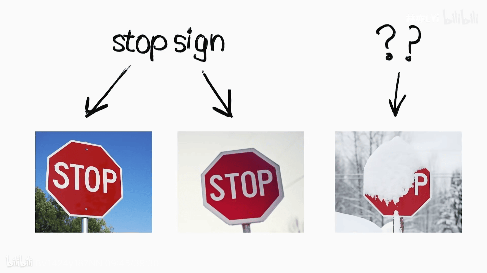

# 启示、标志牌、与人造智能体

以这个标志牌为例。

对于人来说，对第三个牌子的理解的建立，
是怎样的一个过程？

可以确定的是，人是首先理解了「一物覆盖一物」的逻辑，
也就是说，见过大量的雪覆盖事物的景象、
大量别的什么覆盖事物的景象，
然后对于一个被雪覆盖的标志牌，
就可以轻松得出结论：这个标志牌，**本来不是这样**。

人类的经验构建过程绝对不是硬着头皮
顶着一堆各种情况下的标志牌，来完成的。
因为人类构建的，并非是针对标志牌的经验，
而首先是对于「一个事物本来的样子
和现在看起来的样子很可能不一样」
这一观点的构建。

`#AI`

这应该就是，人脑和**目前的**电子脑，
在一些「事物理解」的活动上，
会展现出微妙差异的一个原因。

「不协调」的体验，并不在于「那是机械」，
而是在于「没有做好的协调」的确实存在。

毕竟花草树木和柴油发动机一样都是基于自然力的机器而已，
让二者产生不同的重点并不是因为
「后者是人造的因此缺少生命力」
这种神秘主义式的臆测才能想到的东西，
而是在于后者作为一种「从来没有过的形式」
突然出现在一切（与之发生了交互的）
事物的历史进程之中。一个冲突刚刚开始，
因而这种本质上的不和谐，就必然产生产生
在实践体验上的不和谐。

说一个生动的例子：
电影《阿凡达》 (Avatar 2009) ，大家应该都看过吧？
那里面的人类世界就是一个赛博朋克
（我零九年第一次看的时候
甚至不知道赛博朋克 (cyberpunk) 是个啥子），
大公司的科技造物甚至达到了普遍侵占人类肉身的地步。

主角一直有两个选择：
帮助那个在外形殖民的大公司与土著人做工作，
或者加入土著人。

影片结局当然是后一个选择，但在剧情前面部分，
前一个选择对男主而言的分量也是十分足够的。
这个选择就是其上司答应的「给你换一双绝佳的机械腿」。

`#对立统一`

很长一段时间，我都只是把该片理解为，
「形而上的自然」和「形式上的机械」，
这两者的 *二元对抗* 。
但当我真的理解了 cyberpunk 的含义后，
我才明白了看似「自然」的土著人
其实远远比人类要更加数字化这个道理。

土著人星球上已经实现了包括不限于这些科技成果：
基于生物计算的全球化信息联网、超级智能体 EYWA 、
去中心化的分布式数据存储与共享、记忆乃至于精神意志的上传、
超普遍化的意识连接接口、 …… 而人类呢？脑机接口？
相比起来如同是婴儿水平般的粗笨的玩意儿而已，
土著人的反而更合乎卡尔 (1818-1883) 所说的「高级形态」、
就是那个海德格尔 (1889-1976) 也提过的，被形容为
「作为完成了的自然主义，等于人道主义，
而作为完成了的人道主义，等于自然主义，
它是人和自然界之间、人和人之间的矛盾的真正解决，
是存在和本质、对象化和自我确证、自由和必然、
个体和类之间的斗争的真正解决。它是历史之谜的解答，
而且知道自己就是这种解答」的这种社会历史形态。

高下立判可以说是高下立判了，
但绝不是自然和机械谁高谁下。还是那句话，
人的机器和花草树木都「不过是自然力」而已。

而大量观众也都普遍只把它理解为「二元对立」
的另一个因素，则是在观众普遍不知晓 cyberpunk 的前提下，
片中也并没有对于土著星球的历史过程的强调 —— 那些东西就好像是
「现成的」，那么即便再怎么强调「这并不是什么神秘主义的力量」
或者「这也不过只是合乎逻辑的自然力」也没用。

由于缺乏在镜头语言层面的对土著人世界的「历史性质」的强调，
因而只有真的认真想想才会发现，「哪有这种好事」，
「一定是经过某种对抗性斗争才能让整体成长到这种结果的」，
这些道理。这也正如 Avatar 2023 里出现的场景。
在这第二部中，通过台词可以得知，
片中的那种类鲸物种也是经历了他们的历史过程
才有了目前的文化规律。那么，想必像这样的，
过去发生过的改变，也一定可以在未来再发生一次。
特别是随着对新出现的人类入侵的对抗，**以及
与对这对抗状态的适应**。

然而，这只是在台词里提了一下，视觉上的存在感并不强，
只是在故事逻辑里才能够有极其重要的地位。
视觉效果优先向商业扩张目的倾斜也是其导演向来的策略，
或者说，是他不得不用这种策略来应对
目前现实中的在当前历史期间的社会形态。
就是说，他必须让自己的作品家喻户晓，
但是，代价就是要去掉很大程度的批判性、
甚至明面上的作品立意也要流入庸俗化，
而真正有价值的东西就只有
在有一些事先具备的经验和观念后
才能被挖出来用，因而完全不具备普遍宣传批判性思想的作用，
反而还会普遍造成对另一种思想的宣传。

`#Avatar`

人工智能的形态当然也是并非局限的。但看目前的状态，
它显然还是处在一种类似于「考虑如何使用柴油发动机
来为智能手机提供运行的能量」的程度上。

但也正如「路途本身的缺陷就是提供通往下一台阶钥匙的窗口」，
事情也在起变化，并且，也当然不仅是按人们所想的那样。

譬如，目前的流行方案是堆叠大量神经元，
并试图借此去实现一个貌似强人工智能的结果。
但， *量变达成的质变并不会自动出现在你希望的位置上* 。
 —— 否则这也谈不上叫质变了对吧？
但是：将神经元大量堆叠的实践或许恰恰会成为
否定这一路线的钥匙（而且可能是唯一的），
并如同历史上好多次那样地，再一次地带来这一同样的启示。

这启示当然也并非是对实践活动的否定。因为只有这种看似
「不听劝」的活动，才恰恰是对这种「你又以为错啦」
的启示的现实实现、并且也是达到启示所在位置的唯一途径
 —— 就仿佛你在 ARG 解谜游戏中遇到的那样：
 *在嘲讽你「你已失败」的标语里，
往往就藏着你原本要找的真相* 。

