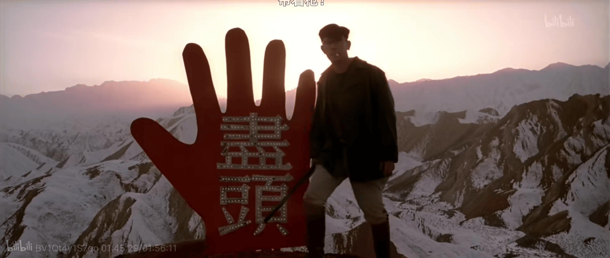

其实道理很简单。如果只关注自己生活中的那点儿事儿，那就不能成为助长人民反对反人类压迫的力量，那就要自食恶果地眼睁睁看着一个影响和恶化自己生活中小事的事情一个一个一个爆发。那这种只管考虑自己小生活的生活态度，也就是成为了对自己只想关注的自己的小生活的理想或者说夙愿的，最无情最冷漠的背叛。

在这里，事情其实很简单。是那个想要怎样怎样的自己，被那个提前认定了尽头和绝望的自己，给背叛了。

把这样一个符号性的尽头认定为现实性的尽头，这才是要沉进最大的绝望里，可谓是比世界之夜还要世界之夜了 —— 当然，就是说，这本身就是一个幻想。

世界或者说历史是断裂的。时间的存在、时间的并不是「绝对不可能得到识别」，这就是其证据。

「事实上，生产关系和生产力二者永远无法达成真正的调和。达成了，这就是符号化的终极成功。但共产主义乃是符号化的永恒失败啊。」

*只能说你没懂，不能说你没看见。*

*星星之火，可以燎原。*
