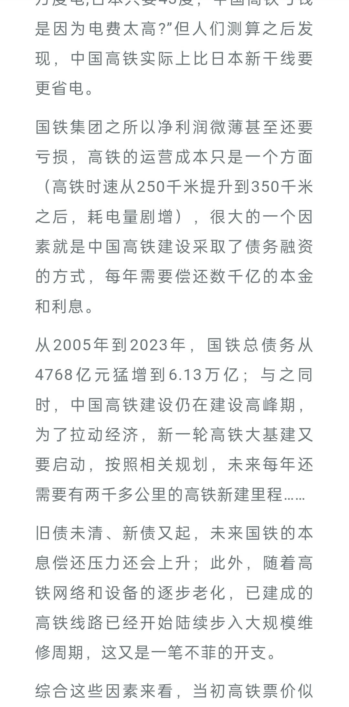
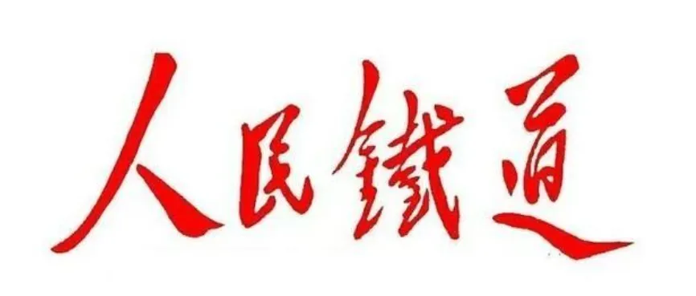

我就在想来着，现代资产阶级的统治的最最基本的前提就是其不在场性，这句话到底怎么理解。走路上，我忽然想起来一个词，大家都听过，叫什么，看不见的手。那这看不见的手可算是找到主了，合着是你的手啊，那确实看不见，因为你只能接受看不见。

然后就看到了这个：

啥叫看不见的手啊！这就叫看不见的手啊！你找不着它，你归咎原因也轻易归咎不着它，完了它还能吸你的血，这吸血效率也还完全不影响、甚至因此能够加速，名正言顺着咧！

那这么着一来，铁路部门要想对得起下面这几个字，也就会越发越发地困难。。。

