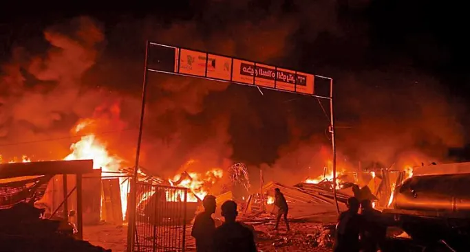
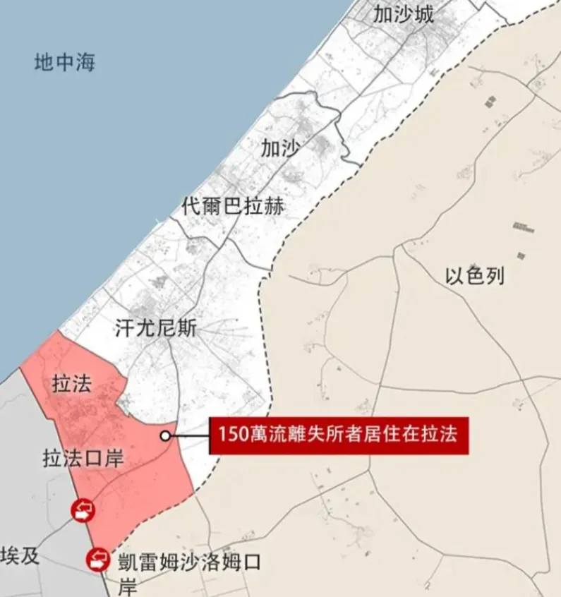
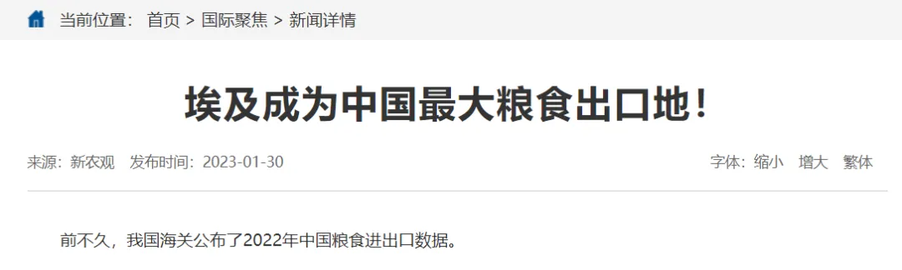

# [分田单干为何让埃及人挨饿？](https://mp.weixin.qq.com/s/btGUCFjnZjPyixW7n-gyOQ)

文 / 子午

以色列再次制造了令人发指的大屠杀。

上周日（26日）晚，以军使用了美国制造的2000磅炸弹袭击了拉法的塔尔苏丹难民营，逾50人死亡、数百人受伤，遇难者大多是妇女和儿童，其中很多是被活活烧死的。此前，以军已将该难民营所处地区列为“安全区”，还要求加沙民众撤离到这里。

此外，以军在当晚还空袭了加沙的另外十余处平民避难所，造成了约200名巴勒斯坦平民死亡。自去年10月以来，战争直接或间接造成了3.5万巴勒斯坦平民死亡。

遗憾的是，对于这场令人发指的大屠杀，无论是西方的媒体还是国内的主流媒体，均没有给予太多的关注。

不过，一直对自己的阿拉伯兄弟隔岸观火的埃及，似乎要被这场大屠杀拖进来了。据以色列多家媒体报道，以军与埃及士兵在拉法口岸发生了交火，一名埃及士兵在此次“罕见”交火中死亡。

以色列在埃及边境的大屠杀，更像是要进一步驱赶数以百万计的巴勒斯坦人，将战火随同巴勒斯坦人的难民营一起，引到埃及的西奈半岛，以彻底掌控加沙地带，并进一步觊觎西奈半岛这块“应许之地”。

被以色列逼到了这一步，正在因粮食危机困扰的埃及现政权，恐怕不得不有所回应了。

历史上，埃及曾被誉为“帝国粮仓”，为罗马帝国四处征伐提供粮食保障。然而现如今，埃及已经成为“最大的小麦进口国”，粮食自给率不足两成，86%的小麦依赖进口，其中绝大部分进口自俄罗斯和乌克兰。

俄乌战争的发生让埃及很快面临巨大的粮食危机，不得不寻找新的粮食进口来源。在这个背景下，埃及成了中国最大的粮食出口地。

这不能不说是莫大的讽刺：回到70年前，中国的人均耕地面积还要少于埃及；70年过去了，埃及竟然还要从人口第一大国进口粮食。

1952年革命发生前，腐朽的法鲁克王朝统治着埃及，占人口极少数的封建地主和资本家垄断了埃及主要的土地、工厂和商店。在农村地区，不足6%的人口控制着全国65%的耕地，其中拥有200公顷以上耕地的大地主，只占土地所有者总数的0.1%。

1952年，纳赛尔领导的“7·23革命”推翻了法鲁克王朝的腐朽统治，在埃及废除了封建君主制。

掌权后的纳赛尔首先在埃及进行了一系列的土地改革，迫使大地主将土地分成小片出售给贫农，无法售出的部分被政府以债券收购，然后分给了农民，一定程度上在埃及实现了“耕者有其田”。

遗憾的是，纳赛尔政权的统治基础基本由埃及的小资产阶级统治精英组成，他们妄图搞阶级调和，要走资本主义与社会主义之外的“第三条道路”。

纳赛尔将右翼的伊斯兰分子与左翼的共产党人统统关进了监狱，在城市工厂鼓吹劳资合作，在农村则是停留在平分土地、让农民单干的小私有制阶段，并没有效仿中国继续走农业合作化、集体化道路。

处于单干状态的埃及农民，根本无力进行基础农业设施建设以及维修，更不可能进行种子改良；

因为土地的碎片化，埃及政府一开始免费发放的大量农机无用武之地，最终闲置报废；

埃及本来有大片沙漠边缘地带可以改良成耕地，而单干状态下的农民根本不可能去完成土壤改良和国土整治这样的宏伟工程；

因为无法规模化经营，农业生产力水平与工业生产力水平差距越拉越大，埃及本土农产品价格无论相比国际粮价还是相比国内工业品价格都不可能有优势，小农种地的积极性越来越低，私人资本就更加不愿意投资大概率赔钱的农业，这导致埃及的农业投入逐年下降，粮食自给率不断走低……

观察以上种种因素，我们再对比毛泽东时代中国的农业方针，就不难发现埃及无法实现粮食自给的根本原因。在埃及这面镜子面前，我们也不难发现，那些鼓吹“分田单干让中国人吃饱饭”的说法是多么的荒谬！

1970年，萨达特上台后进一步修正了纳赛尔的路线：归还了大资本的财产，让富农回到政权中来，为抑制左翼思潮，与右翼的穆兄会达成政治交易，实现了与大资产阶级、大地主的阶级结盟……

1981年，穆巴拉克上台，延续了萨达特的路线，极力推动私有化和自由放任的经济政策，一方面大量农村人口涌向城市，沦为城市无产阶级，进一步促进了埃及农业的破产，粮食全面依赖国际进口；另一方面，阿拉伯传统文化的回归，促进了埃及人口的爆炸式增长……两方面原因共同造成了埃及今天的粮食危机。

