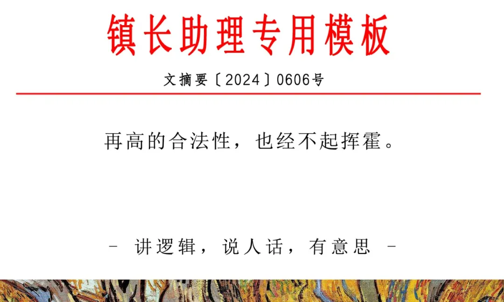
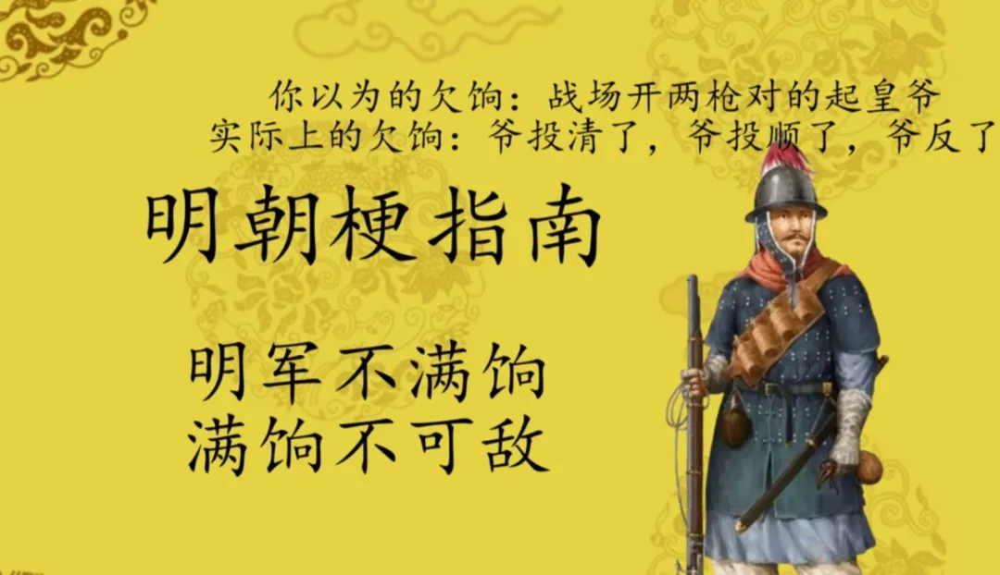
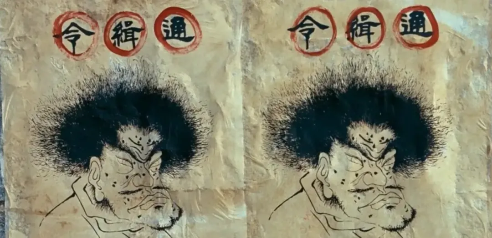
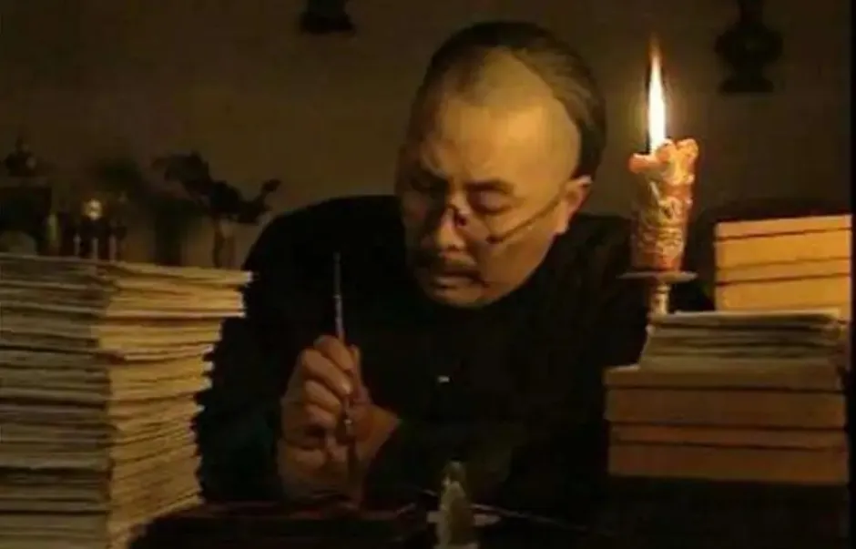
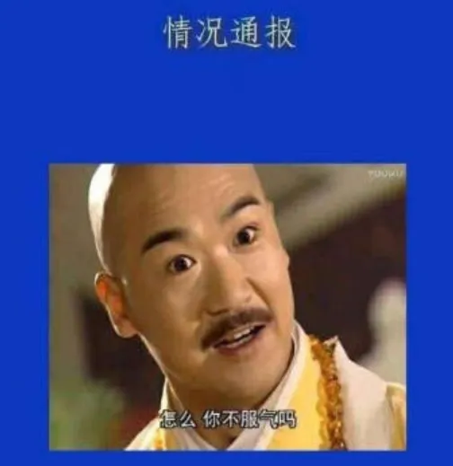
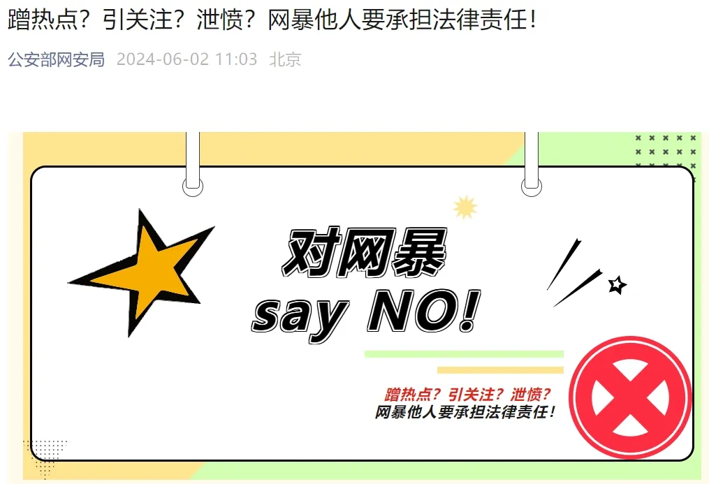

# [太祖的遗产与诅咒](https://mp.weixin.qq.com/s/FQgX5bT9jydWXJdkaQOLyw)

假如有两家公司给你发来offer。甲公司的主业是扶危济困，而且历史上有过很多荣誉，但这家公司不仅不发工资，还会要求员工自己掏腰包做慈善。

乙公司主业是偷抢拐骗，历史上是犯罪集团洗白上岸。但这家公司愿意出高薪，而且搞到赃物后会给员工大分红。

假如只有这两家公司可选，你必须选一家时，你选谁？

历史上，甲公司叫晚明，乙公司叫清朝。

明清易代一直是争论很大的话题。抛开清朝的民族成分和晚清的问题不谈，“杀无粮人”到“剃发、圈地、逃人法”几大恶政就彰显了清朝“得国不正，杀戮太过”。

而明朝，“自古得国之正者唯汉与明”。明太祖不仅驱逐鞑虏推翻暴政，而且**晚年铁腕治贪，不惜对曾经一起打天下的老兄弟们开刀**，这和推崇宽容放任丰沛元勋的汉高祖不同，明太祖也因此被抹黑。

然而历史却是低合法性的清朝击败了高合法性的明朝，难怪一直有人抱不平。

但他们的思路反了，明朝的问题恰恰就是**太祖得国太正，给后代留下了太丰厚的政治遗产，以至于这份遗产反而成了诅咒**，正如沙特因为石油太多的“资源的诅咒”而摆脱不了宗教和王权统治一样。

而清朝的低合法性，反而逼着皇帝勤政，用微操抵消战略的劣势。

清朝皇帝一想起祖上入关时欠下的血债，是睡不安稳的，只能起来处理政务，生怕一点疏漏引发起义导致被清算。

很多人鼓吹的清朝赈灾第一也是这样逼出来的，对于一般朝代，灾民通常先怪自己命苦后怪老天不仁，最后才会怪朝廷昏庸。所以赈灾并不紧急。

但对于清朝，一旦灾民挨饿就意味着遍地的反清组织有机会把新账旧账一起算。**驱使清朝赈灾的不是仁慈，而是求生欲**。

明朝的皇帝，把自己视为明太祖继承人的**他们也理所当然地认为“太祖有功德就等于我也有功德”**，躺在了先辈的功劳簿上。

在他们看来，救民疾苦的德政已经由太祖代他们做了，仗也由太祖太宗代他们打完了。**他们觉得民众感激太祖的恩德，就该对作为太祖继承人的他们言听计从**。

这种傲慢由上到下传导，所以马宁远会认为**一张布告就能让百姓乖乖听话，完全不顾歪曲事实强制堵嘴的公告是在损害前辈千辛万苦积累下的公信力**。

到了明末，更是出了让作为基本盘的军户无饷出战甚至自费勤王的事。随着基本盘的六个钱包被掏空，太祖累积的政治遗产也被挥霍殆尽。

于是，文明辉煌的大明被强盗集团清朝击败了。清朝野蛮凶残，但**知道不能割断韭菜的根，更知道要拿出利益收买愿意为他们出力的基本盘**。

当被多铎的刀架到脖子上时，江南的官吏们是否会想起曾经**玩弄文字、用一张张A4宣纸践踏一个个普通人生活的日子**。

前辈遗留的高合法性高公信力，如果好好珍惜，就是珍贵的遗产；如果成了放纵自己无视民意的理由，那就成了诅咒，毕竟**再高的合法性，也经不起挥霍**。

不要让他的遗产变成诅咒。
