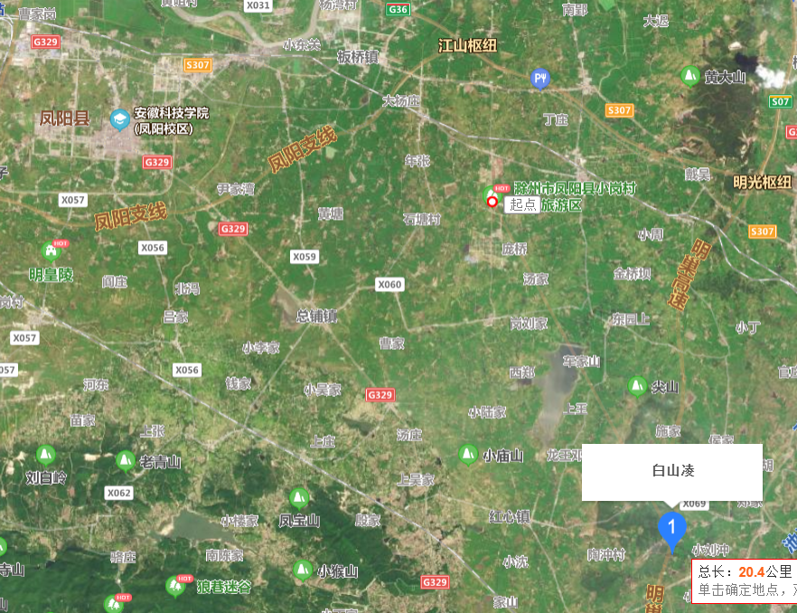
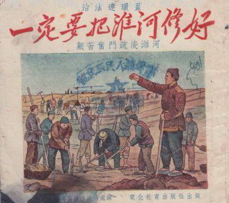
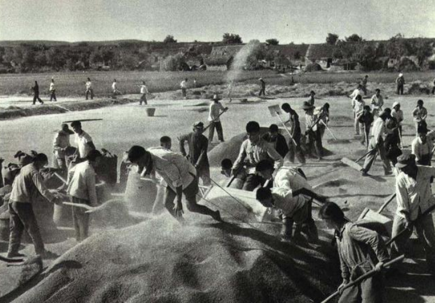
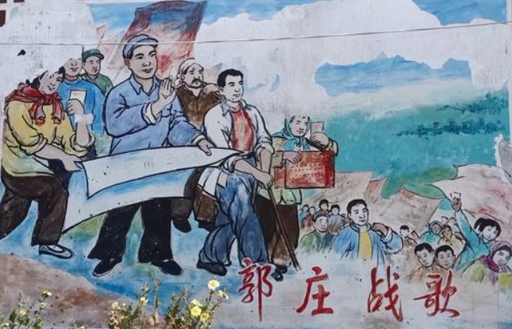
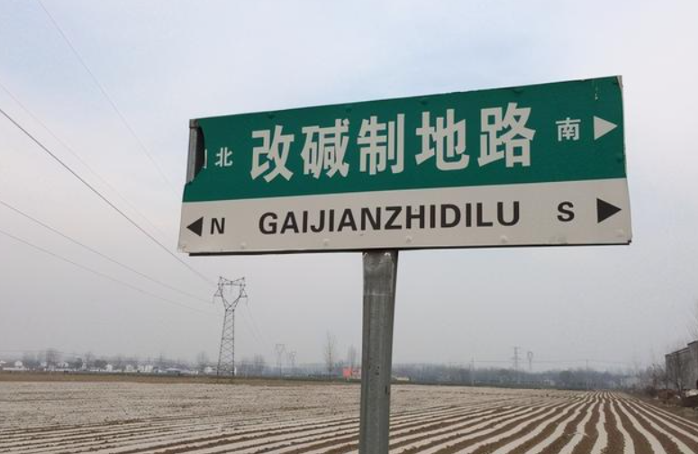
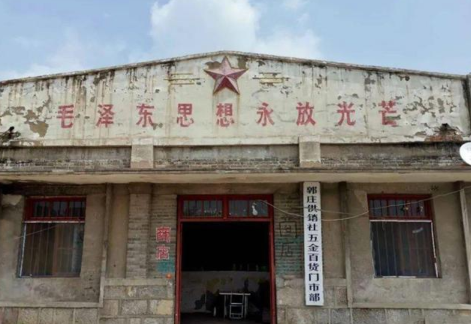
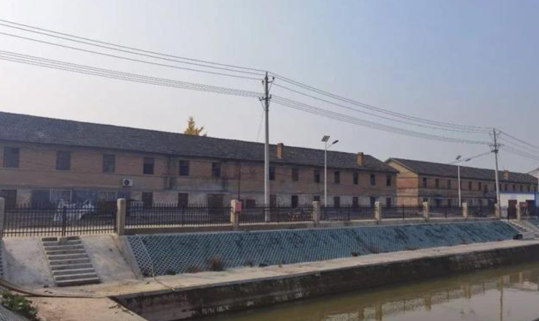
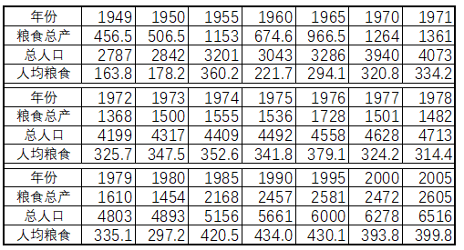

# 张文茂老师揭开了毛时代被指责“饿肚子”的奥秘

文 / 秦明

听闻张文茂老师病逝的消息，深感悲痛。

张文茂老师关于人民公社历史的研究视角独特、价值极高，笔者之前的几篇介绍毛时代社队企业、农村工业化历史的文章，都受过他的启发和教诲。

斯人已逝，笔者忽然想起张文茂老师生前反复念叨的一个问题：“1974年我国粮食人均超过三百公斤，历史意义重大，足以反驳‘崩溃的边缘’之类的虚假宣传，（毛泽东时代的）历史可以暂时被忽视、抹黑，但是后人总有一天会记起它，并还其本来的真面目！”

我国在1974年达到人均占有粮食303公斤，1975年达到307.9公斤，1978年达到316.5公斤。这个指标的实现意味着什么？

人均占有600斤的原粮，如果按照80%的成品率来折算，人均年占有成品粮480斤，等于每个月人均可以达到40斤的成品粮标准，这说明1974年已经解决了中国人的温饱问题！

张文茂老师引用了马克思的一句名言：“超过劳动者个人需要的农业劳动生产率是一切社会活动的基础”，指出了三个方面的重大意义：

第一，意味着农村的土地利用结构可以逐渐调整了，可以腾出部分耕地种植经济作物；

第二，说明大农业的农、林、牧之间的产业结构也可以逐渐调整了，可以拿出更多的粮食用于加工饲料发展畜牧业，适宜还草、还林。

第三，为加快整个农村的产业革命进程提供了前提条件，更多的农村劳动力可以转入二三产业，农村经济可以进入毛主席早就规划好的公社工业化发展阶段，开始逐渐地向以工业化为主导的农工商并举的发展阶段转变。

张文茂老师之所以反复强调“1974年人均粮食突破300公斤指标”这个问题，就在于这个问题一方面揭示了毛泽东时代已经能够解决中国人的温饱问题，另一方面揭示了这一条件的实现为后面农村的改革奠定了坚实的物质基础。差别只是怎么改的问题，是“完善公有制”、发展社队企业，还是“退回私有制”、发展乡镇企业。

张文茂老师对这个问题的阐述才是历史唯物主义的态度；而那些鼓吹18手印、“一包就灵”、“一单干就吃饱饭”的说法，则完全是唯心主义的臆想，完全抹杀了毛泽东时代水利建设、农田改造、种子改良以及引进化肥生产线等等，这些实现粮食增产的客观物质基础。

为了更直观地说明这个问题，这里附上笔者以前的一篇文章，以纪念张文茂老师。

## 安徽人民是如何解决吃饭问题的？

子夜呐喊  2021-06-25

这篇文章要从与小岗村相距20公里的凤阳县白山凌村说起。

白山凌是位于安徽凤阳东南部、群山环抱之中的一个小山村。而整个凤阳县则位于淮河中下游南岸，淮河水在滋养出这片肥沃土地的同时，也给这一区域带来了无穷无尽的水患。

> 说凤阳，道凤阳……  
> 十年倒有九年荒，身背花鼓走四方。

这段凤阳花鼓词，道尽了解放前饱受水患和战乱之苦的凤阳人民的辛酸生活，那时很多凤阳人不得不背井离乡、外出乞讨。在解放前的白山凌村，42户人家中就有39户有过“身背花鼓走四方”的悲惨经历。

1950年6月26日-7月25日，淮河流域持续降雨1个月，引发了严重的洪涝灾害，凤阳也成为一片泽国。当看到安徽灾民为躲避洪水在树上被毒蛇咬死的报告之后，毛主席泪流满面、彻夜未眠，从7-9月的两个月时间里连续4次批示要加快治理淮河。1951年，毛主席又为治淮工程亲笔题词：“一定要把淮河修好。”

毛泽东时代的治淮工程，累计投资不下200亿，完成土方76亿立方米，混凝土1000万立方米；兴建大、中型水库34座，各类水库5200余座，行洪控制工程10处，新开河道20余条，彻底控制了淮河流域的水旱灾害；结合除涝，治理了1700万亩盐碱地；建成了淠史杭等灌区，灌溉面积由50年代初期的1200万亩增长到1.1亿亩，即便是1978年大旱，灌溉面积也保证到了8800万亩。

在治理淮河的过程中，凤阳人民疏竣淮河河道，在临淮关镇上游地区加固堤防，将防洪标准不断提高，拓宽行洪区；依据洪水的走势，凤阳县选择在淮河右岸，建设了一座关键节点工程，进洪闸，彻底杜绝了旱涝灾害的侵袭。

由治淮工程开始的大规模的农田水利建设，是安徽人民为解决吃饭问题所做出的第一次巨大努力。安徽全省的粮食总产量从1949年的456万吨，一跃增长到农业合作化运动高潮的1955年的1153万吨。

而真正改变安徽农村贫困面貌的，是其后的人民公社，这就要说回本文的主角——白山凌村。

与处于平原地区的小岗村相比，群山环抱的白山凌村的自然地理条件在凤阳县属于最差的。

解放前的白山凌是一个“三面环山一面坡，羊肠小道穿村过，荒山秃岭无良田，口子一停就要饭”的穷山村。

解放以后，白山凌的贫下中农在毛主席革命路线指引下，走上了农业合作化的道路，成了凤阳县梅市公社白山凌生产队。

1966年冬天，白山凌生产队的社员们遵照毛主席关于“兴修水利是保证农业增产的大事，小型水利是各县各区各乡和各个合作社都可以办的”的教导，由生产队长郭金香、凌万禄带领社员在庙山和棵子山之间摆开战场，筑水坝、建水库。

没有资金自己筹，不懂技术自己学，没有测量仪器就用土办法灵活代替。最终靠着简陋的工具和无穷的干劲，筑起了高10米、宽46米、长360米的南大坝，修建成一座能蓄水60万方的水库，使全队灌溉保收面积由原来的40多亩，一下子扩大到570多亩。

在兴修水利的同时，白山凌生产队的社员们还掀起了积肥和改地运动，采取各种办法改良土壤，将100多亩耕性差、适耕期短、只能种水稻的马肝地，改造成了一年两季、可以种麦子的肥沃田；在55块坡度大、沙石多的山岗地上修起了梯田，种上了水稻。全队粮食产量连年大幅增长，1967年比上年增长38%，1968年增长55%，1969年增长55%，1970年更是实现了农、林、牧、副、渔的全面发展。到1971年，白山凌生产队全年每人平均口粮达350公斤，每户平均收现金310元。

梅市公社白山凌生产队的社员们在谷场上晾晒稻谷

过上丰衣足食日子的白山凌社员们开展了丰富的业余文化生活，曾经被用来乞讨的凤阳花鼓这一传统艺术被重新拾起，不过，70年代白山凌的凤阳花鼓词已经彻底变了样，成了人们歌颂伟大领袖毛主席、歌唱白山凌幸福新生活的文艺形式：

> 说凤阳，道凤阳，凤阳真是个好地方；  
> 自从来了共产党，千年的穷窝变了样；  
> 白山岭上栽桃梨，山坡梯田稻谷香；  
> 家家户户喇叭响，北京声音遍山庄……  

解放前，全村只有六个识字的人，都是地主、富农。而到了1972年，白山凌生产队所有适龄儿童都进了新建的小学，许多老年贫农也上了夜校，一般都能读毛主席著作和报纸了；30多名初高中毕业生，成了生产队里的教师、医生、会计和农业科学实验的骨干力量。

解放前，贫下中农根本看不起病，只能靠身体硬抗，1943年，村里传染了流行性脑膜炎，一个月就死了40多人；毛主席“把医疗卫生工作的重点放到农村去”的指示下达后，社员们有头痛脑热，不用出村就可以就近治疗；传染病流行季节，赤脚医生、巡回医疗队就事先做好了各项防治工作；1967年，一位贫农的儿子得了急性脑膜炎，生产队承担了全部医疗费用。

以上这些内容整理自1972年2月《人民日报》的报道以及相关地方史料。而就在人民日报的报道发出时，白山凌的社员们又搞起了水电站，准备按照毛主席的指示大办社队企业……

在小岗村的覆盖式宣传面前，白山凌生产队的这段艰苦创业史早已被淹没。然而，即便如白山凌生产队这样的典型，放到整个安徽，其实还算不上先进典型。

安徽省树立的农业学大寨的典型是萧县郭庄大队，1970年，中共安徽省委发出“学大寨、赶郭庄、超纲要”的号召，这更是一段令人敬仰和震惊的人民奋斗史，以后有机会笔者再详细讲。

后来郭庄又走回了分田单干的老路，原本集体所有的社队企业、供销社陆续被承包……如今的郭庄只能零星看到昔日盐碱地改造以及上世纪五六十年代修建的“供销社”、“合作社”、“大食堂”、“知青宿舍”的遗迹，诉说着历史的悲壮与荒凉。

当地人为了纪念盐碱地治理的历史修了这个路牌

人民公社的这段历史后人自会给出公正的评价。

三年自然灾害期间，安徽省的受灾程度是比较严重的，更加严重的是官僚主义的问题，由此引发了大面积的饥饿，是饥饿程度最严重的三个省之一，另外两个则是河南和四川。2003年中央文献研究室出版的《毛泽东传（1949-1976）》第22、23章，用了两章的篇幅讲述了毛主席“纠‘左’的努力”。毛主席的努力在这三个省受到的抵制同样是最严重的，某些高级干部为了政绩、头脑发热，大刮“五风”，最终酿成了严重的后果。

1962年1月11日至2月7日，扩大的中央工作会议在北京召开，参加会议的级别一直到县委、重要工矿企业和部队的负责干部，共计7000多人，史称七千人大会。毛主席开这次会的目的，就是总结经验，统一认识，加强党内的民主集中制，以便进一步纠正“大跃进”以来工作中的错误。毛主席提出要把这次大会开成一个“出气”会，让基层干部畅所欲言。在安徽组的会议上，参加会议的县委书记们，对安徽“负责人”愤怒极了，控诉他在大跃进中怎么虚报，怎么打击抵制他搞浮夸的干部，后来又怎么隐瞒饥荒不上报，从极左跳到极右“刮单干风”……

七千人大会后，李大钊同志之子李葆华调任安徽。李葆华同志怀着坚定的共产主义理想，坚持搞集体经济、限制“包产到户”。（注：1966年，李葆华遭到错误批斗，毛主席一路力保，后来又调李葆华去了贵州当书记）

经过李葆华同志领导下的调整，依靠人民公社的集体力量，1965年安徽省的粮食总产量恢复到了967万吨；1966年人均粮食产量突破300公斤——基本达到人类的热量安全线（就是我们通常说的温饱问题）；1976年的粮食总产量更是达到了1728万吨、人均产量379公斤！（值得注意的是，1977-1978年又出现连续减产）

到这时，安徽人民其实已经可以宣布“解决了吃饱饭”的问题。这个历史功绩是巨大的，我们不能拿小岗的18户农民的状态来指代整个安徽四千万人的状态，更不应以此否认农业集体化和安徽四千万人民的历史贡献。

--------

## 附：安徽省历年粮食总产量（万吨）、总人口（万人）、人均粮食产量（公斤）

说明1：1979年，国家为了促进农业发展，将粮食征购价格提高20%，降低征购指标，计划外征购价格再额外提高50%；70年代引进的13条大型化肥生产线在70年代末、80年代初陆续投产；1976年试验成功的杂交水稻等良种改良的成果也开始陆续推广……这些因素共同推动了80年代的粮食增产，90年代中期以后增长就开始放缓、甚至是下滑。

说明2：表中历年粮食总产量数据来自国家统计局网站。某些官样文章张口就说，“统计表明，新中国前20年，安徽粮食总产量从1949年的639.0万吨增长到1969年的933.0万吨,年均增长率仅1.9%”，不知道这个“1949年的639.0万吨”是哪里的“统计”？

