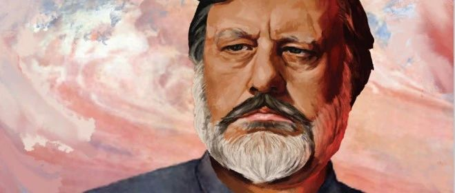

(re-lefted-revol)

# 左翼从不哀悼死亡，而是在忧郁中拥抱希望 —— 关于今日的暴力与斗争

- 文 / Misaki Offiziell
- 布 / 异见Andersverstehen
- 位 / 2024-04-11 08:01 四川

> 对中国人来说，生活从来没有像今天这样剧烈地被撕裂着。在物化市场的魔域中，生存已在照亮了宗法土地的太阳（理性之光）阴影中被分化为两节：一节是在这个沙漏般的竞争世界中悬临于空中的“成功”人士（过去叫“布尔乔亚”），另一节则是跌落入沙漏底层的“弱势”众生（过去叫“普罗泰利特”）。在第一种人那里，可能银行里有无数的金钱，故而，“他”会开着宝马，拥着美人，身上甚至还揣着博士学位证书，在生活舞台的重重射灯探照之下，他诗意地“在”着。而在第二种人那里，炫目灯光下功成名就的“他”成了“我”毕生不懈奋斗的镜像，“他”就应该是“我”。我们在泥泞的沙漏边缘攀爬、滑倒、再攀爬——一如加缪笔下那个荒谬而不屈的西西弗斯。
> 
> 张一兵 《不可能的存在之真》
> 

## 商品、学生与朝圣者 —— 主人从未消失

鲍德里亚《消费社会》中讲述了美拉尼西亚的土著人对于天上飞过飞机的心醉神迷，他们想要来自西方的飞机在他们那里降落，于是他们在地面布置了一系列机场的相似物，希望以此引导飞机降落于他们的土地。

美拉尼西亚的神话或许从未因文明扫清了愚昧而消逝，鲍德里亚以这此来讽刺当今的“游荡在城市丛林里的类人猿”，过去的宗教信仰者摆放贡品，祈求神的赐福，而消费社会中的人们则相信货币与商品的魔力，拥有其“使用价值”的商品实则和贡品无异，只不过朝贡的对象变成了较神明与飞机更为实在的资本主义大他者，鲍德里亚称当代人同样是在堆砌符号——富裕的符号，以此来谋求幸福。

商品、学历、金钱作为这个时代的物神（fitesh），代替了传统意义上的宗教中早已死去的上帝，拼凑成一个个较前资本主义时代更为真实的梦境，为无家可归的现代人不断地允诺着彼岸的归宿。

藏传佛教虔诚的信仰者会将自己的很大一部分财产和时间用于朝圣，他们相信自己的苦难会给自己修得来世的幸福，在朝圣路上不敌疾病与劳苦死去的藏民，在他们的群体中被认为是内心不够虔诚，意志不够坚定，所以无法到达终点——藏民的这种意识形态是通过一种前现代的再生产机制运作的，宗教用主人话语发出询唤，孩童们的意识形态简单地从他们父母的话语和自己跪拜的膝盖中再生产出来。当代社会中的人们某种意义上同样在进行着这样的朝圣，宗教的意识形态国家机器——教会在今天被学校所替代，学校并非像资本主义符号秩序塑造的那般，作为一个无害的、温馨的场域使本来是“非人”的无知的孩子长大“成人”——我们甚至不需要去特意去关注衡水模式下挣扎的学生：“干呕男孩”在誓师大会上的吼叫、六百分的成绩真的很耀眼的女孩，渴望拱大城市白菜的张锡峰；大多数学生自己就处于一种激烈的竞争状态中，高考前一百天的“提高一分，压到千人”对我来说还历历在目——这口号不就是学校再生产作用的再清楚不过的表征？

学校温馨的场所同恶劣的朝圣之路有着相似的结构——朝圣路上倒下的朝圣者是“不够虔诚的人”，而在现代科举制度中被淘汰的学生是“不够努力的学生”。从这点看来高考制度远没有佛祖的大慈大悲，毕竟佛祖的仁慈可能会可怜每一个“不够虔诚的人”让他们顺利到达拉萨，但高考制度绝不会让每一个学生都顺利考上本科。学校在产生一个未来的剥削者时，也必须产生多得多的受剥削的人——只不过学校的的“治安”结构让我们认为资本家的诞生必然要感谢学校/社会的抚育，而工人的诞生是因为他们是“不够努力的差生”。学校的生产了社会分工的意识形态——资本主义时代中的工人阶级是身份是他们匮乏的能力导致的，所谓成功人士的身份是他们出色的智识和不断的努力应得的。

> 沿途掉队的每一批人，撇开或多或少的失误或失败不说，实际上大致都被提供了与他们在阶级社会必须充当的角色相适应的意识形态：被剥削者的角色需要“高度发达的”“职业的”“道德的”“公民的”“民族的”和非政治的意识；剥削的当事人的角色需要一种向工人发号施令和对他们讲话的能力；镇压的当事人的角色需要有发号施令和强迫人们“无条件”服从的能力，或是玩弄政治领袖的修辞术进行煽动的能力；而职业的意识形态家的角色则需要一种带着尊重（即带着恰如其分的轻蔑、敲诈和煽动）去影响人们意识的能力，以大谈道德、德性、“超越”、民族和法兰西的世界地位之类的论调。
> 
> 阿尔都塞 《论再生产》
> 

这里我们要谈到被齐泽克复读无数次的典故：国王之所以是国王，是因为臣民向他跪下，认为其是国王，并不是其凡人的躯体包裹了某个崇高的灵魂——所以说一个国王如果真的以为自己是国王，那他比一个疯子认为自己是国王更加疯癫。当今这种前现代的主人话语——不管是什么人，只要为臣民所跪拜，他就是国王——这种暴力仿佛已经消失。今天的“成功人士”总被认为拥有某方面的特殊能力和坚定的意志——我们常常能看到书店里摆放的关于某个企业家成功创业的书籍，企业家站在工人的身躯上向中产诉说着自己的勤奋，但我们常常忘记，这些“成功人士”大部分或是遇上了特定的时代（这样的时代早已过去），或是本身就拥有丰厚的家产，而这是大部分人望之莫及的。主人话语在现代变成了披着“技术”“知识”的外壳的大学话语——学校传授学生一些“占统治地位意识形态包裹的本领”、资本家永远是较工人更有能力的个体，但资本家的地位，同国王的地位被封建制度所赋予一样，同样被一套资本主义符号秩序所赋予——布尔乔亚从小就在接受“精英文化”的教育，即使长大后不继承父母的衣钵，他们在布尔乔亚喜闻乐见的教养、艺术、还有一些特殊的技能——一些知识分子家庭会很早对孩子进行专业技能如计算机语言的培训，这些方面他们在上学期间胜于常人，在完成学业进入市场后父母也容易通过强硬的“羁绊”为其较快找到不错的工作……。如同布尔迪厄中所说：

> 对一些人来讲,学到精英文化是用很大代价换来的成功;对另一些人来讲，这只是一种继承，它同时包含着便当和便当的诱惑。
> 
> 布尔迪厄 《继承人：大学生与文化》
> 

## 富裕的“征兆” —— “与你我无关！”

我在今年春运返乡的火车上与一位同乡的工人交流时，他告诉我他在广东打工的经历：“你十九岁啊？我那时候正好就你这个年纪，十几年前来的广东，人生地不熟。那时候年轻气盛，也想在这儿干出一番事业，但是干了几年我也麻木了，生活完全没改变多少……工作忙的时候一周就休息一天，工作累倒还能接受，主要是夏天太热了，车间里温度真的受不了。——有人中暑的话，老板都给买了保险，不用负多大责任，直接送医院就行，你不知道它有多残忍……广东发展很快？是很快啊，但与你我无关不是么？”

比起用富裕、幸福来描绘资本主义，我认为那位工人所说的“与你我无关”更适合对其进行描摹。大城市的灯红酒绿的景观和阶级跃升的叙事生产出了这位工人的痛苦与孤独，十多年来残酷的现实让他的激情消散在弥散的机油中，“发展”并没有兑现它许下的允诺，飘浮着香水味的高级娱乐场所与其中纵情享乐的布尔乔亚终究是与他风马牛不相及的彼岸的生活。而他只能每天面对着车床进行着麻木劳累的工作，底层人民贫穷的生活作为整个丰裕的景观的“例外”暴露着大他者自身的匮乏。

经济学家在计算财政数据时并不会去关注生产总值增长的来源——战争的耗费、奢侈品与丢进垃圾桶里的食物等等和支持无产者生命维持的消费同样起着使生产总值增长的作用，如鲍德里亚所说：“任何生产出来的东西，都因存在这一事实本身而变得神圣了”。我们经常听到人说：不消费经济怎么发展？——进行着奢侈消费的主体在这一刻，从精致的利己主义布尔乔亚摇身一变，成为了最关心国家发展的“康米主义者”。布尔乔亚作为社会中真正的主体代替作为“非主体”的无产者进行着无休止的狂欢。巴迪欧质问道：“我们要花多久才能接受这个事实:足够全人类享用的自来水、学校、医院和食物所需的金额相当于富裕的西方国家一年花费在香水上的数量！”布尔乔亚随手的挥霍可能是无产一年的生活花费，而他们却还在叫嚣着：我是在为经济增长助力！“拜物教”在这里体现淋漓尽致——经济学家关注的是一种去除了“人”的生产总值增长，好看的数字本身就能抚平一切的苦难与啼哭。

> 我们在这里讨论的，是现代社会最不寻常的集体性欺骗，是“数字”上面的“神术般的”操作。实际上，它掩盖了一种集体迷恋的巫术。我们讨论的是荒谬的计算的幻象、全国财务的机械性的体操动作。
> 
> 鲍德里亚《消费社会》
> 

齐泽克称“马克思发明了征兆”：同消费景观与生产总值的富裕伴随着背后的无产者的贫穷一样，布尔乔亚意识形态的普遍性必然生产出无产阶级这个例外。资本主义社会仿佛能给每个人都提供一个确证自己地位的普遍性幻象，资本向我们言说它的真理：你享有自由！任何东西都能作为商品在市场上流通！商品交换是等价的！然而正是资本主义的“自由”使得工人有了出卖劳动力的“自由”，从而带来了工人的“不自由”。任何东西都能成为商品使得“人”也可以成为商品，商品交换的等价让我们认为资本家给工人的工资返还了工人工作生产的价值，然而生产的过程却产生了“剩余价值”，剩余价值颠覆了等价交换规则。资本主义的自由平等规则生产出了一个超越规则本身的“征兆”（symptom）——无产阶级的存在就是资本主义生产方式的社会性征兆，无产阶级被剥削的事实时时刻刻颠覆着布尔乔亚的”自由平等“的普遍合理性。

美拉尼西亚人仰望的飞机永远不会在他们所在蛮荒之地降落，阶级跃升的梦想总是在本来就是“人上人”的群体中继承，资本主义庞大的商品累积永远只是给少数人消费，“自由”的允诺也从未在普罗中兑现……“与你我无关！”——意识形态所允诺的普遍性总是虚假的，我们正是普遍性生产出的那个例外。

## 狗智主义的失败 —— 意识形态的物质性

揭露意识形态的虚假性——布尔乔亚的自由之虚假、阶级跃升的梦之虚无，这是马克思主义的传统意识形态批判方式，如马克思在《资本论》中所说：“他们一无所知，但他们依然为之。”意识形态是统治班级构建出的幻象，掩盖了真实的剥削生产关系。个体对现实的“误认”使得布尔乔亚意识形态完美地再生产自身，而只要我们发现了社会“本来的样子”，资本主义构建的幻象便会烟消云散。

当代的有些所谓“左派”尝试破除现代人对“物”的信仰，自居资本主义非理性世界中理性的主体，将一切娱乐场所都斥责为布尔乔亚享乐加以拒绝，将一切为了生活在资本主义符号秩序下的爬升称之为“反gm”，他们重复着这样自以为激进的活动，在网络平台中进行着布道者式的言说。

抛开自由派在看到这段话时，意淫“网左”的愚昧，大谈历史上的创伤性事件，告诉人们这些“宗教”只会让我们“通向奴役之路”；也暂且不谈“网左”是否只是会在网上夸夸其谈，生活中可能并未实际参与任何实践。这里的意识形态批判程序本身在今天就是不可能的，齐泽克在《意识形态的崇高客体》中指出当代的“狗智主义”（cynical）主体对布尔乔亚意识形态的虚假性心知肚明，但依然按其行事。“他们知道如此，但他们依然为之”——上图这段话中不也指出“我们都知道资产阶级意识形态的毒害”？但事实上这种“知道”并没有破除意识形态的迷雾。

当我们批评拜物教时，仅仅在“知”的层面去为一切神圣的布尔乔亚物神祛魅是不够的，我们常常会得到一种恋物癖式否认：“我很清楚……，但是……”——今天的我们不再是那个认为国王拥有某种神力的臣民，我知道佛像由是泥土砌成，国王去除其头衔后空无一物，但我仍然对其低下我们的头颅；我知道明星并不会爱我，但我依旧穿上婚纱出席演唱会；我知道富裕的符号叠加并不能通向幸福，但我们还是不断去消费资本主义庞大的商品堆积；我们知道货币作为一种物质客体与其他物质客体并无不同，但我们还是将其当作一种神圣之物去不断追赶。

马克思所说的“物化”（Versachelichung)指的是我们的恋物癖式颠倒——人与人的关系被颠倒为物与物的关系。而齐泽克称，我们很清楚货币没有任何魔力，它只是作为商品交换的媒介赋予我们占有一部分社会产品的权利，但是我们在行为上表现得好像货币凭借本身的魔力成为了财富的化身；我们很清楚物的关系背后是人的关系，但我们的行动表现得好像物已成为了主体的替身。

> 只有意识形态的世界观才能想象出无意识形态的社会，才能同意这样的空想：意识形态总有一天会被科学所代替，并从世界上消失得无影无踪。
> 
> 阿尔都塞 《保卫马克思》
> 

意识形态是一种外在的无意识结构，意识形态并不是处于“知”的层面的信仰，而是被我们的行为仪式生产出来的客观现实。我们并非因为信仰而跪拜，而是我们跪下，信仰就随之而来。齐泽克称狗智主义主体误认的并非现实，而是误认了幻觉——意识形态并非遮蔽社会真实形态的幻觉，而是结构现实的无意识幻象。

信仰是客观的——如藏民将经文写于经幡上，经幡会替人们诵经；劳累一天的我们回到家中刷刷视频，即使我们什么也感觉不到，“罐头笑声”也会代我们欢笑；葬礼上的哭灵人痛哭流涕，在场的每个人哀悼的义务得以完成。今天的人不再相信，而是物代人相信。

齐泽克在《意识形态的崇高客体》中讲述了一则有关“玉米症”患者的笑话：有一个人以为自己是一粒玉米，于是他去精神病院治好了自己的”玉米症“，但他出院后看到鸡后仍然会害怕被它吃掉，医生问他现在知道自己不是玉米了，为什么还害怕被鸡吃掉，他告诉医生：我是知道我不是玉米，但鸡不知道啊!”齐泽克告诉我们：如果不重视信仰的客观性，我们可能成为这个“玉米症”患者。

## 左翼 —— 忧郁中拥抱希望

> 在今天的中国，资产阶级已经不叫资产阶级，而叫“成功人士”，并成为人们崇拜的对象；无产阶级也不叫无产阶级，而叫“弱势群体”，成为人们同情的对象。一般人际称谓中的“同志”变成了“老板”、“先生”, “学雷锋”改做“志愿者”。这是一种隐性的微观话语转换。似乎，人们开始“默默地假定自由—民主的资本主义全球秩序在某种意义上是最终发现的 ‘自然的’社会政体”。资本主义再一次被确认为天然的社会存在方式。历史好像又回到了马克思当年所面对的那种“没有历史”的境遇之中了。
> 
> 张一兵 《文本的深度耕犁》（第二卷）
> 

上世纪六十年代蔷薇革命失败，九十年代苏联解体，历史发展到在今天资本主义几乎遍布世界的所有角落，布尔乔亚在这个时代仿佛已经宣告他们的完全胜利，历史好像要在布尔乔亚的动物化的狂欢声中结束。如今我们应该以何种方式去面对资本主义的全球化，还有如何面对在今天仍然作为幽灵游荡在世界上空的共产主义的幽灵与马克思主义？

左翼——今天的左翼身在何处？左翼大学话语的代理人在理论上言说激进，而他们却把理论早已变成了一种与现实毫不相干的游戏，面对人们过去的历史难题与今天的生存困境，张一兵在《回到马克思》中高呼：“给人民以激情与给人民以科学的结果是根本不同的。中国人已经受激情支配和摆弄太久了！”可悲的是今天我们既看不到激情也看不到科学。部分网左自诩 派，每天梦游于过去的历史中，时不时呼唤孙大圣来安慰现实的贫瘠。部分网哲每天活跃于亚文化圈，线上在丝毫没有接触现实的层面进行着无意义的理论游戏，线下时不时进行一些无意义的混圈串联，哲学对他们只不过是代替原神的身份认同工具，他们通过窃取一点点大他者的剩余快感而沾沾自喜。

如今什么都不做就高呼“共产主义终将到来”的时代已经过去了，这种历史宿命论不过是弱者用来自我安慰的人生哲学，同基督教的“活着的时候受苦，死后上天堂享福”同样都是一种不具备足够力量的从属阶级的精神胜利法。

> 当你在斗争中不具有主动权，斗争本身在最终变得和一系列的失败相等同的时候，机械决定论就变成道德抵抗、融贯团结、坚忍不拔和不屈不挠的一种巨大力量。‘我暂时被打败了，但是，历史的潮流归根到底是为我而流的’。现实的意志穿上了一种信仰历史的某种合理性和信仰原始的和经验形式的热情的目的论的外衣，这种目的论是作为前定和神意等忏悔的宗教教义的替代品而出现的。
> 
> 葛兰西 《实践哲学》
> 

我想今天的我们应该去选择成为“行动者”，所谓行动，应该是去投身进时代里谈论问题，而不是像犬儒主义者一样猥琐地与其保持距离——犬儒主义者享受于在大他者的凝视下大谈时事，却又在某个恰当的时间互相会心一笑“这是不能碰的滑梯”，他们以为自己是后意识形态的自由主体，却不曾知道意识形态并非存在于他们信仰的洁身自好，而是被他们自己的行为仪式所生产的淫秽不堪。他们一次次地在大他者之下躲躲藏藏进行着这种淫荡的自慰，却还因自己没有社出来而感到沾沾自喜。

所谓行动，不应该是自由主义者那样鼓吹包容少数群体的特殊性，沉浸于身份认同（女性、性少数群体）的可悲游戏中，在现有符号秩序之下标榜自由与民主，每天执着于通过法律谋取自己的“人权”，进行着这种自以激进的空转。而是要去认同征兆——意识形态排除一些例外（犹太人，黑人，女人）来维持自己的普遍性，而“认同征兆”就是要去将这些特例标举为真正的普遍性——我们都是犹太人/黑人/女人。如齐泽克所说：“真正的普遍主义者绝不鼓吹包容差异，鼓吹无所不包的统一性，而是会投入热情的斗争之中，为了标举真理而奋斗。”无产阶级就是资本主义的征兆，认同征兆就是认为“我们都是无产阶级”，将全世界的无产阶级联合起来，把解放斗争进行到底。

我想在今天的这片土地上，从来不缺少贫困者的苦难与符号秩序的暴力，只是资本主义的“治安”让我们对一切视而不见。阿尔都塞称个体在路上被警察叫住的时候被“询唤”为主体，而朗西埃称主体事件正好是警察驱赶人离开的时候发生的，想想警察对我们的高喊：“走开！没什么好看的”，我们在各种各样的场景中并没有参与其中的布尔乔亚法权，面对很多事件，我们看似在自由地进行着评论，事实上我们只是没打赢复活赛的牢大，我们对这些事件只能回复“我没意见”——我们并没有被建构为社会秩序的主体，而是和科比一样的“似人”。科比对于网络平台上的各种抽象玩梗没意见，但网友并不会因此去放弃拿科比来享乐。我们对于符号秩序的暴力没意见，但这并不意味着符号秩序就因此不复存在。所谓中产阶级不过是掩饰阶级矛盾的意识形态幻象，他们同样作为工人阶级在生产过程中被剥削。

齐泽克用“忧郁症”来形容今日的左派处境。“忧郁不同于哀悼，哀悼是对死亡的完全接受，忧郁则是对逝去之物永不忘怀的眷恋”。行动者正如义无反顾的安提戈涅，安提戈涅去埋葬死者的行动并不是哀悼死亡，而是以忧郁的身姿与整个城邦的法相对抗——行动者总是在忧郁中拥抱希望。

> 正是怀着这些忧郁的想法，我将此书介绍给中国的读者。全世界都在注视着中国，都在思索:那里正在发生的巨变，将会如何终结？我跟他们一样满怀希望。
> 
> 齐泽克 《实在界的面庞》中文版前言
> 

____

*duplicated from [here](https://mp.weixin.qq.com/s/nw-RgFPukGP8C-KQHLwPcw).*

