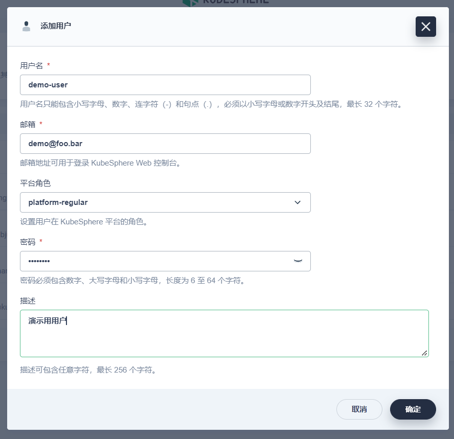
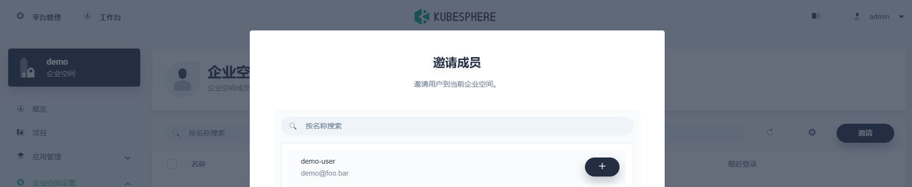
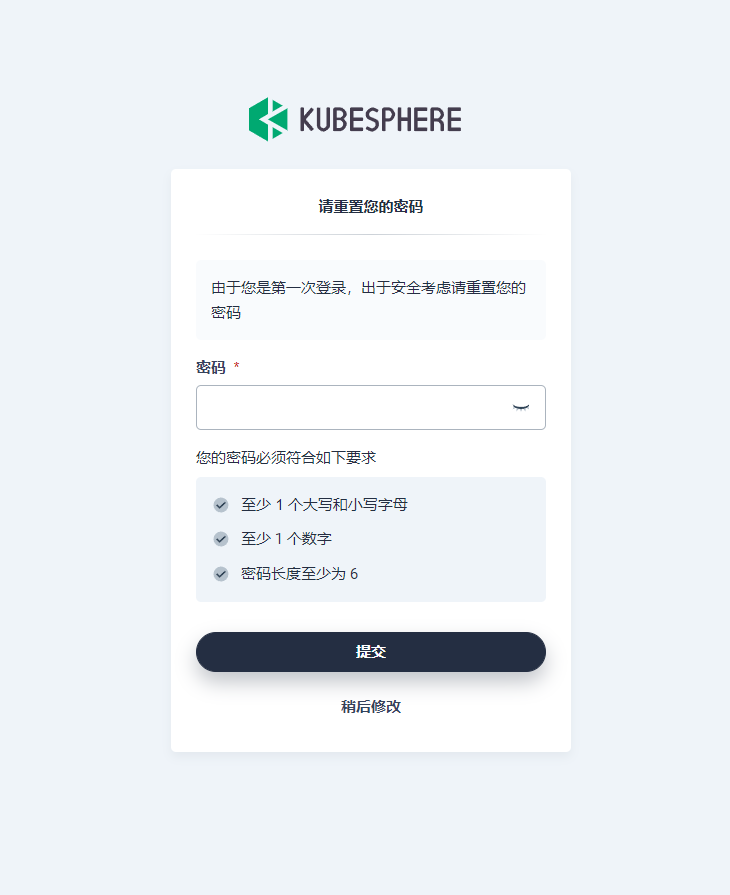
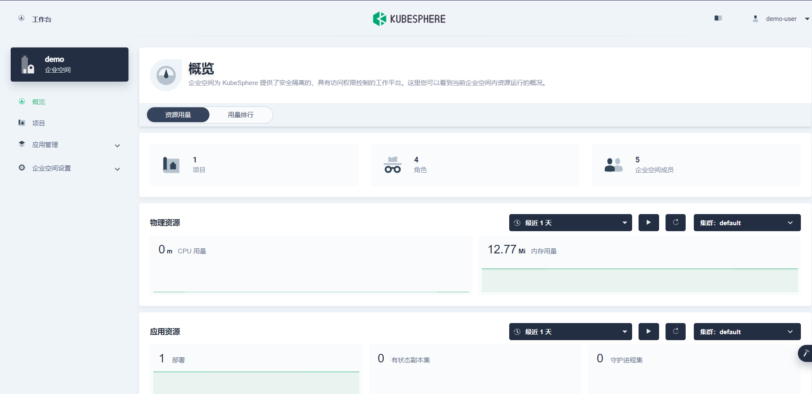
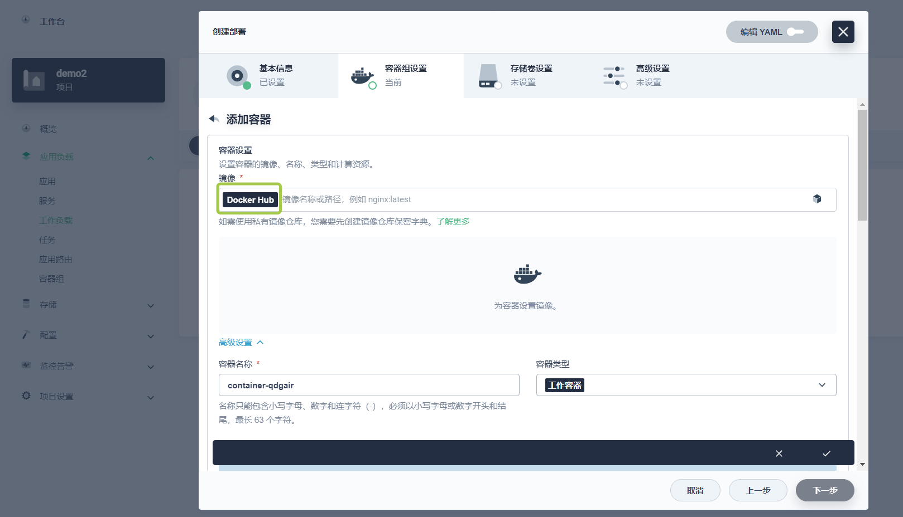
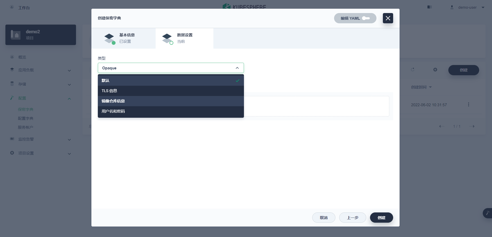
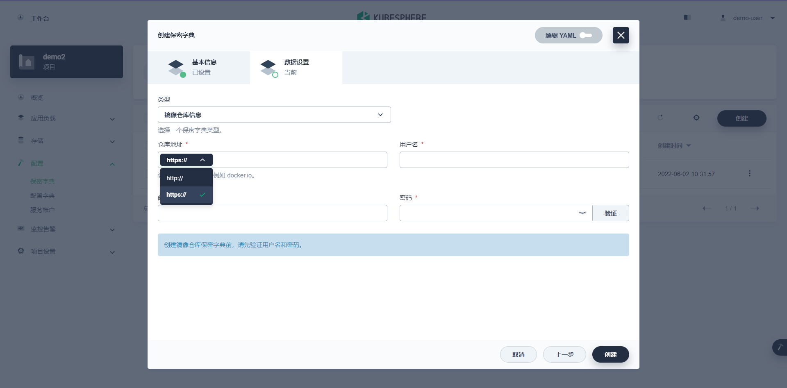

像这样新增示例用户：

保存。

在示例企业空间成员里增加该用户：

我这里邀请之为该企业空间管理员。确认保存。

登出 `admin` 用户，登入 `demo-user` 用户。

创建用户时的密码只是初始密码，用它登入会被提示设置自己的密码：

可设置或跳过。

登入成功后就可以看到自己有权访问的企业空间了：

## 私有 Harbor 使用

ref: `https://kubesphere.io/zh/docs/project-user-guide/configuration/image-registry`   

在创建“部署”类型的工作负载的时候，对其管理的容器组添加容器，可以在这里（绿框）选择 Hub 。

但现在我们只有一个 Hub 。

如何增加 Hub ？

在“配置”、“保密字典”界面，点“创建”以增加。

在其中的“数据设置”步，类型选择“镜像仓库信息”：

然后根据自己仓库的情况，选择访问协议并填写必要内容：

验证通过后，创建即可。

之后就可以在创建“部署”类型的“工作负载”时使用这个镜像源了。

另外，在 Kubesphare 以外的界面（比如 Rancher ），你也可以使用在这个项目中创建的“保密字典”；只不过到时候有可能是另外的叫法（比如叫作“密文”等）。在使用时，本质上就是在资源对应的 `Pod.spec.imagePullSecrets` 字段中填充信息，具体可以检查你通过界面创建的“工作负载”的“ `YAML` ”来验证。

